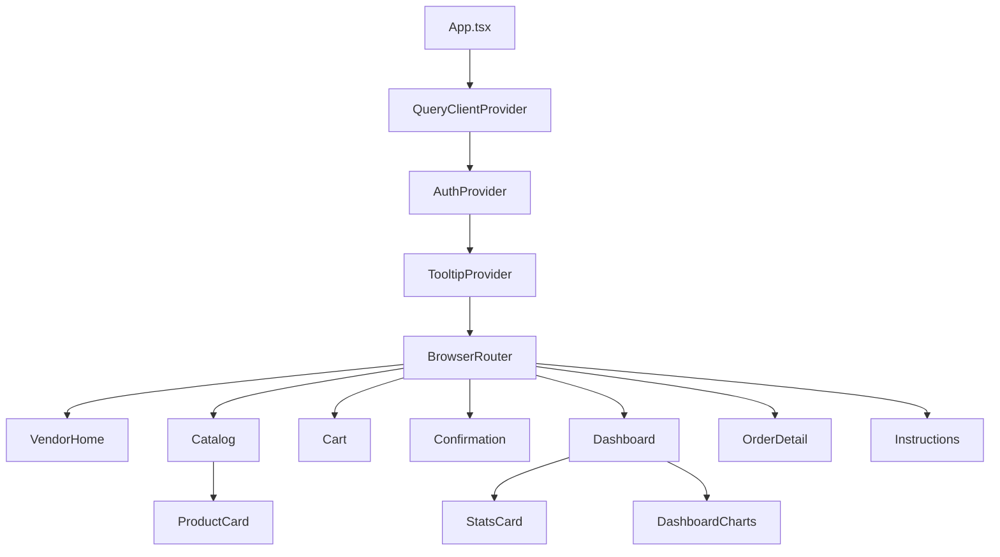
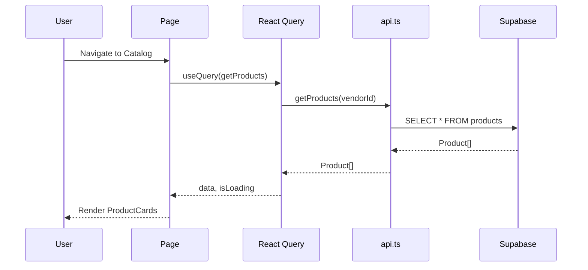

## Architecture Notes

O **Hortifast** segue uma arquitetura de **Single Page Application (SPA)** com React, utilizando uma stack moderna de frontend que se comunica com o Supabase como Backend-as-a-Service (BaaS).

## System Architecture Overview

A aplicação utiliza uma arquitetura **Client-Side Rendered (CSR)** com Vite como bundler. O estado do servidor é gerenciado pelo TanStack Query, que provê cache automático, sincronização e atualizações otimistas.

```
┌─────────────────────────────────────────────────────────────────┐
│                         CLIENTE (Browser)                       │
├─────────────────────────────────────────────────────────────────┤
│  ┌─────────────┐  ┌─────────────┐  ┌─────────────────────────┐ │
│  │   Pages     │  │  Components │  │    shadcn-ui + Radix    │ │
│  │  (Routes)   │──│   (Logic)   │──│      (UI Primitives)    │ │
│  └─────────────┘  └─────────────┘  └─────────────────────────┘ │
│         │                │                                      │
│         ▼                ▼                                      │
│  ┌─────────────────────────────────────────────────────────────┐│
│  │                    Hooks Layer                              ││
│  │  useAuth │ useToast │ useMobile │ useServiceWorker         ││
│  └─────────────────────────────────────────────────────────────┘│
│         │                │                                      │
│         ▼                ▼                                      │
│  ┌─────────────────────────────────────────────────────────────┐│
│  │                 TanStack Query                              ││
│  │           (Server State + Cache)                            ││
│  └─────────────────────────────────────────────────────────────┘│
│         │                                                       │
│         ▼                                                       │
│  ┌─────────────────────────────────────────────────────────────┐│
│  │                    API Layer                                ││
│  │   src/lib/api.ts (getProducts, getOrders, createOrder...)  ││
│  └─────────────────────────────────────────────────────────────┘│
│         │                                                       │
│         ▼                                                       │
│  ┌─────────────────────────────────────────────────────────────┐│
│  │                 Supabase Client                             ││
│  │              src/lib/supabase.ts                            ││
│  └─────────────────────────────────────────────────────────────┘│
└─────────────────────────────────────────────────────────────────┘
                              │
                              ▼
              ┌───────────────────────────────┐
              │         SUPABASE              │
              │  ┌─────────────────────────┐  │
              │  │    PostgreSQL Database  │  │
              │  │  vendors, products,     │  │
              │  │  orders, order_items    │  │
              │  └─────────────────────────┘  │
              │  ┌─────────────────────────┐  │
              │  │    Auth (opcional)      │  │
              │  └─────────────────────────┘  │
              │  ┌─────────────────────────┐  │
              │  │    Storage (imagens)    │  │
              │  └─────────────────────────┘  │
              └───────────────────────────────┘
```

## Architectural Layers

| Layer | Description | Directories | Symbol Count |
| --- | --- | --- | --- |
| **Components** | UI components and views | `src/components/`, `src/pages/` | 90 |
| **Services** | Business logic via hooks | `src/hooks/` | 5 |
| **Controllers** | API request handling | `src/lib/api.ts` | 12 |
| **Utils** | Shared utilities and helpers | `src/lib/` | 11 |
| **Repositories** | Data access and mock | `src/data/` | 3 |

> See [`codebase-map.json`](./codebase-map.json) for complete symbol counts and dependency graphs.

## Detected Design Patterns

| Pattern | Confidence | Locations | Description |
| --- | --- | --- | --- |
| Provider Pattern | 95% | `AuthProvider`, `QueryClientProvider` | Context-based state sharing |
| Custom Hooks | 95% | `useAuth`, `useToast`, `useMobile` | Logic encapsulation |
| Compound Components | 90% | shadcn-ui components | Composable UI primitives |
| Container/Presentational | 85% | Pages vs Components | Separation of concerns |
| Service Layer | 85% | `src/lib/api.ts` | API abstraction |

## Entry Points

- [`src/main.tsx`](../../src/main.tsx:1) - React DOM render
- [`src/App.tsx`](../../src/App.tsx:19) - App component with providers

## Public API

### API Functions (src/lib/api.ts)

| Function | Type | Description |
| --- | --- | --- |
| `getVendor(id)` | Query | Buscar vendedor por ID |
| `getAllVendors()` | Query | Listar todos vendedores |
| `getProducts(vendorId)` | Query | Listar produtos de um vendedor |
| `getProductsByCategory(vendorId, category)` | Query | Filtrar por categoria |
| `createProduct(product)` | Mutation | Criar novo produto |
| `getOrders(vendorId)` | Query | Listar pedidos do vendedor |
| `getOrderById(id)` | Query | Buscar pedido específico |
| `createOrder(order)` | Mutation | Criar pedido |
| `updateOrderStatus(id, status)` | Mutation | Atualizar status |
| `createOrderWithItems(order, items)` | Mutation | Criar pedido completo |

### Hooks Exportados

| Hook | File | Purpose |
| --- | --- | --- |
| `useAuth` | `src/hooks/useAuth.tsx` | Autenticação e sessão |
| `useToast` | `src/hooks/use-toast.ts` | Notificações toast |
| `useIsMobile` | `src/hooks/use-mobile.tsx` | Detecção de mobile |
| `useServiceWorker` | `src/hooks/use-service-worker.ts` | PWA registration |
| `useOnlineStatus` | `src/hooks/use-service-worker.ts` | Status de conectividade |

## Internal System Boundaries

### Bounded Contexts

1. **Catalog Context** - Gestão de produtos e categorias
   - Pages: `VendorHome`, `Catalog`
   - Components: `ProductCard`

2. **Cart Context** - Carrinho de compras
   - Pages: `Cart`
   - State: Local storage + React Query

3. **Order Context** - Gestão de pedidos
   - Pages: `Cart`, `Confirmation`, `OrderDetail`, `Dashboard`
   - Components: `DashboardCharts`, `StatsCard`

4. **Auth Context** - Autenticação
   - Provider: `AuthProvider`
   - Hook: `useAuth`

## External Service Dependencies

| Service | Purpose | Auth Method | Rate Limits |
| --- | --- | --- | --- |
| **Supabase** | Database + Auth | API Key (anon) + JWT | 500-1000 req/min |
| **WhatsApp** | Finalização de pedidos | URL scheme | N/A |
| **Lovable.dev** | Deploy e hosting | OAuth | N/A |

### Failure Considerations
- **Supabase down:** Fallback para mock data local
- **Offline:** Service Worker cache para navegação básica
- **WhatsApp indisponível:** Exibir dados para contato manual

## Key Decisions & Trade-offs

### 1. SPA vs SSR
**Decisão:** SPA com Vite
**Razão:** Simplicidade, deploy fácil no Lovable, PWA nativo
**Trade-off:** SEO limitado (aceitável para app B2C)

### 2. Supabase vs Custom Backend
**Decisão:** Supabase BaaS
**Razão:** Desenvolvimento rápido, PostgreSQL, Auth incluído
**Trade-off:** Vendor lock-in, limites do plano free

### 3. shadcn-ui vs Component Library
**Decisão:** shadcn-ui
**Razão:** Componentes copiáveis, customização total, acessíveis
**Trade-off:** Mais código local, manutenção manual

### 4. React Query vs Redux
**Decisão:** TanStack Query
**Razão:** Server state optimizado, cache automático, menos boilerplate
**Trade-off:** Curva de aprendizado para casos complexos

## Diagrams

### Component Hierarchy



### Data Flow



## Risks & Constraints

| Risk | Impact | Mitigation |
| --- | --- | --- |
| Supabase Free Tier Limits | Medium | Cache agressivo, batch queries |
| PWA Install Rate | Low | UX clara para instalação |
| Mobile Performance | High | Lazy loading, code splitting |
| Offline Data Sync | Medium | Retry logic, conflict resolution |

## Top Directories Snapshot

| Directory | Files | Purpose |
| --- | --- | --- |
| `src/components/ui/` | 49 | shadcn-ui components |
| `src/pages/` | 9 | Route pages |
| `src/lib/` | 4 | Utilities and API |
| `src/hooks/` | 5 | Custom React hooks |
| `public/` | 5 | Static assets, PWA manifest |

## Related Resources

- [project-overview.md](./project-overview.md) - Visão geral do projeto
- [data-flow.md](./data-flow.md) - Fluxo de dados detalhado
- [codebase-map.json](./codebase-map.json) - Mapa completo do codebase
