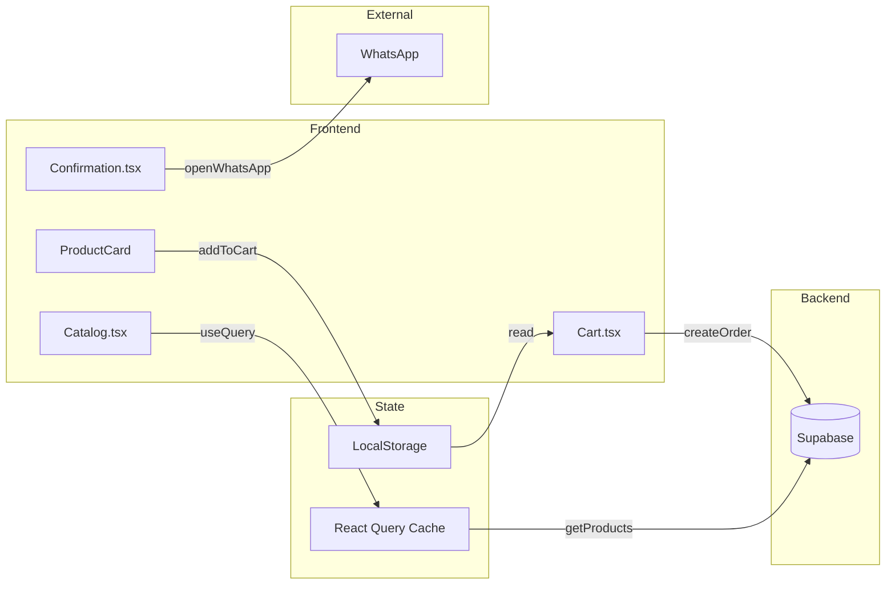
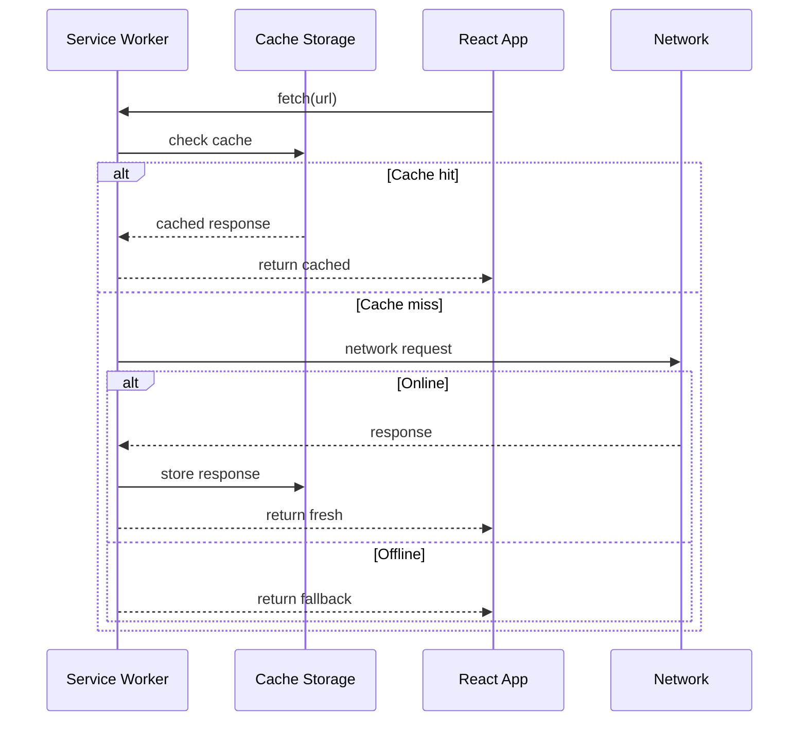

# Data Flow & Integrações

## Fluxo de Dados Principal

### Catálogo → Carrinho → Pedido



## Integrações

### Supabase

**Connection:**
```typescript
// src/lib/supabase.ts
const supabase = createClient(
  SUPABASE_URL,
  SUPABASE_ANON_KEY
);
```

**Tables:**
| Table | Description | RLS |
| --- | --- | --- |
| `vendors` | Dados dos vendedores | Read public |
| `products` | Catálogo de produtos | Read public |
| `orders` | Pedidos realizados | Protected |
| `order_items` | Itens dos pedidos | Protected |

### WhatsApp Integration

**Fluxo:**
1. Cliente finaliza pedido
2. Sistema gera mensagem formatada
3. Abre link `wa.me/{phone}?text={message}`
4. WhatsApp nativo/web abre com mensagem

**Formato da Mensagem:**
```typescript
// src/lib/utils.ts
export function generateOrderShareMessage(
  order: Order,
  items: OrderItem[],
  products: Product[]
): string {
  return `🧺 *Novo Pedido*\n\n${formattedItems}\n\n💰 Total: R$ ${total}`;
}
```

## Server State (React Query)

### Query Keys
```typescript
['vendor', vendorId]
['products', vendorId]
['products', vendorId, category]
['orders', vendorId]
['order', orderId]
```

### Cache Strategy
| Query | Stale Time | Cache Time |
| --- | --- | --- |
| Products | 5 min | 30 min |
| Vendors | 10 min | 60 min |
| Orders | 1 min | 5 min |

### Mutations
```typescript
// Create order
useMutation({
  mutationFn: createOrderWithItems,
  onSuccess: () => {
    queryClient.invalidateQueries(['orders'])
  }
})
```

## Client State

### LocalStorage
| Key | Data | Purpose |
| --- | --- | --- |
| `cart` | CartItem[] | Carrinho persistente |
| `selectedVendor` | string | Vendedor atual |

### Auth State
```typescript
// AuthContext
{
  user: AuthUser | null,
  isAuthenticated: boolean,
  login: (credentials) => Promise<void>,
  logout: () => void
}
```

## Offline Flow (PWA)



## Error Handling

### API Errors
```typescript
try {
  const data = await getProducts(vendorId);
  return data;
} catch (error) {
  toast.error('Erro ao carregar produtos');
  // Fallback para mock data ou cache
}
```

### Network Errors
- Service Worker retorna cache
- UI exibe indicador offline
- Mutations são enfileiradas (futuro)

## Métricas e Logging

### Eventos Rastreáveis
- Page views
- Product views
- Add to cart
- Order completion
- Error events

### (Futuro) Analytics Integration
```typescript
// analytics.ts
export function trackEvent(name: string, data: object) {
  // Integração com analytics
}
```

## Related Resources

- [architecture.md](./architecture.md)
- [security.md](./security.md)
- [codebase-map.json](./codebase-map.json)
