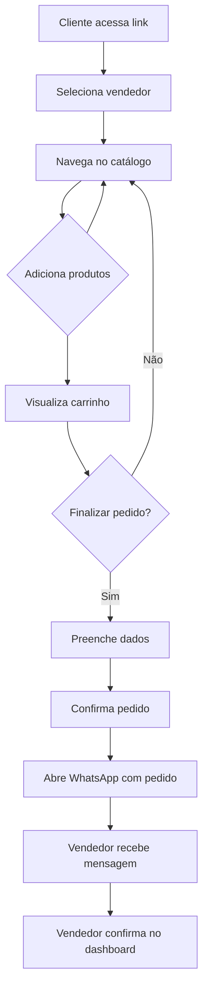

# Glossário & Conceitos de Domínio

## Termos do Negócio

### Vendedor (Vendor)
Comerciante de hortifruti que utiliza o sistema para gerenciar seu catálogo e pedidos. Cada vendedor possui seu próprio catálogo de produtos.

**Atributos:**
- ID único
- Nome
- Telefone/WhatsApp
- Horário de funcionamento

### Produto (Product)
Item disponível para venda no catálogo do vendedor.

**Atributos:**
- Nome
- Descrição
- Preço unitário
- Unidade de medida (kg, unidade, maço, etc.)
- Categoria
- Imagem
- Disponibilidade

### Categoria (Category)
Agrupamento lógico de produtos para facilitar navegação no catálogo.

**Exemplos:**
- Frutas
- Verduras
- Legumes
- Temperos
- Orgânicos

### Pedido (Order)
Solicitação de compra realizada por um cliente.

**Status possíveis:**
- `pending` - Aguardando confirmação
- `confirmed` - Confirmado pelo vendedor
- `preparing` - Em preparação
- `ready` - Pronto para retirada/entrega
- `delivered` - Entregue
- `cancelled` - Cancelado

### Item do Pedido (OrderItem)
Linha individual dentro de um pedido, representando um produto e quantidade.

**Atributos:**
- Produto
- Quantidade
- Preço no momento da compra

### Carrinho (Cart)
Coleção temporária de itens que o cliente pretende comprar.

**Comportamento:**
- Persistido em localStorage
- Convertido em Order ao finalizar
- Esvaziado após confirmação

## User Personas

### 👨‍🌾 Vendedor de Hortifruti
**Contexto:** Comerciante local que vende frutas, verduras e legumes em feiras ou comércio fixo.

**Necessidades:**
- Catálogo digital para compartilhar com clientes
- Gestão simples de pedidos
- Comunicação via WhatsApp

**Dores:**
- Anotações manuais de pedidos
- Dificuldade em divulgar produtos
- Controle manual de entregas

### 🛒 Cliente
**Contexto:** Pessoa que deseja comprar produtos de hortifruti.

**Necessidades:**
- Visualizar produtos disponíveis
- Comparar preços
- Fazer pedido rapidamente
- Comunicação direta com vendedor

**Dores:**
- Não saber o que está disponível
- Dificuldade em calcular total
- Esquecimento de itens

## Regras de Domínio

### Preços
- Preços são definidos pelo vendedor
- Podem variar diariamente
- Unidade de medida é informativa (ex: R$ 5,00/kg)

### Pedidos
- Quantidade mínima não é obrigatória
- Total calculado automaticamente
- Pedido finalizado via WhatsApp

### Catálogo
- Produtos são organizados por categoria
- Produtos sem estoque podem ser ocultados
- Imagens são opcionais

### Horário
- Vendedor define horário de atendimento
- Pedidos podem ser feitos fora do horário
- Confirmação depende do vendedor

## Fluxo do Usuário

## Métricas Importantes

| Métrica | Descrição | Importância |
| --- | --- | --- |
| Pedidos por dia | Volume de vendas | Alta |
| Ticket médio | Valor médio de pedido | Alta |
| Taxa de abandono | Carrinhos não finalizados | Média |
| Tempo de confirmação | Velocidade de resposta | Média |
| Produtos mais vendidos | Popularidade | Média |

## Related Resources

- [project-overview.md](./project-overview.md)
- [data-flow.md](./data-flow.md)
