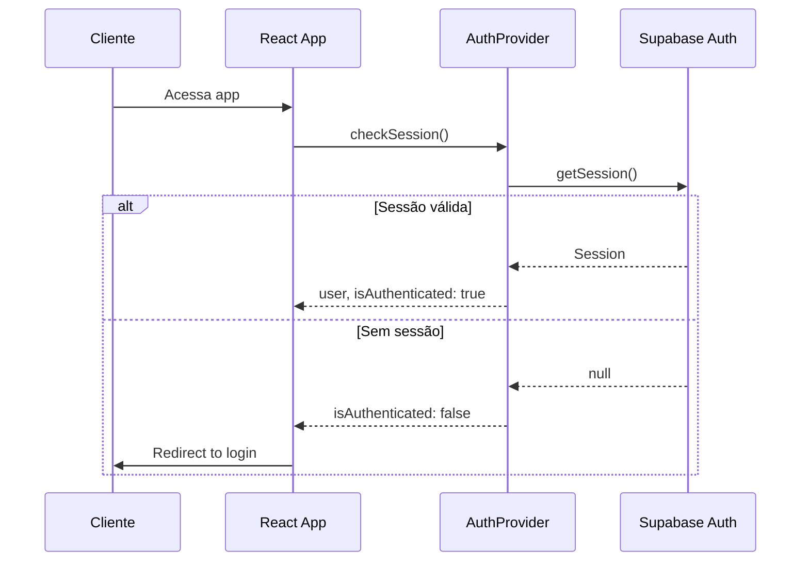

# Security & Compliance Notes

## Modelo de Autenticação

### Arquitetura Atual

O sistema utiliza um **AuthProvider** customizado que gerencia o estado de autenticação:

```typescript
// src/hooks/useAuth.tsx
interface AuthContextType {
  user: AuthUser | null;
  isAuthenticated: boolean;
  login: (credentials) => Promise<void>;
  logout: () => void;
}
```

### Fluxo de Autenticação (Planejado)



## Row Level Security (RLS)

### Políticas Planejadas

```sql
-- Vendedores podem ver apenas seus próprios dados
CREATE POLICY "Vendors see own data" ON vendors
  FOR SELECT
  USING (auth.uid() = id);

-- Produtos são públicos para leitura
CREATE POLICY "Products are public" ON products
  FOR SELECT
  TO public
  USING (true);

-- Pedidos acessíveis pelo vendedor
CREATE POLICY "Vendors see own orders" ON orders
  FOR ALL
  USING (vendor_id = auth.uid());
```

## Gestão de Secrets

### Variáveis de Ambiente

| Variable | Descrição | Sensibilidade |
| --- | --- | --- |
| `VITE_SUPABASE_URL` | URL do projeto Supabase | Pública |
| `VITE_SUPABASE_ANON_KEY` | Chave anônima (pública) | Pública* |

> *A chave anônima é pública por design no Supabase, a segurança é garantida por RLS.

### Boas Práticas
- ✅ Nunca commitar `.env` no repositório
- ✅ Usar `.env.example` como template
- ✅ Configurar secrets no ambiente de deploy
- ✅ Rotacionar keys periodicamente

## Segurança do Frontend

### XSS Prevention
- React escapa conteúdo por padrão
- Evitar `dangerouslySetInnerHTML`
- Sanitizar inputs do usuário

### CSRF Protection
- Supabase usa tokens JWT
- Não há cookies de sessão vulneráveis

### Content Security Policy (futuro)
```html
<meta http-equiv="Content-Security-Policy" 
      content="default-src 'self'; script-src 'self';">
```

## Segurança de Dados

### Dados Sensíveis
| Dado | Classificação | Proteção |
| --- | --- | --- |
| Email do cliente | PII | Criptografia em trânsito |
| Telefone | PII | Não armazenado (vai via WhatsApp) |
| Endereço | PII | Armazenado apenas em pedidos |
| Senhas | Secreto | Hash no Supabase Auth |

### Data at Rest
- Supabase usa criptografia AES-256
- Dados em regiões com compliance

### Data in Transit
- HTTPS obrigatório
- TLS 1.3

## Vulnerabilidades Conhecidas

### Mitigações Ativas
- [x] HTTPS em produção
- [x] Headers de segurança (Lovable)
- [x] Escape automático do React
- [ ] Rate limiting (via Supabase)
- [ ] Audit logs

### Pendentes
- [ ] Implementar RLS completo
- [ ] Adicionar 2FA para vendedores
- [ ] Logging de auditoria
- [ ] Backup automático

## Checklist de Segurança

### Antes do Deploy
- [ ] Verificar `.env` não commitado
- [ ] Remover console.logs com dados sensíveis
- [ ] Revisar permissões RLS
- [ ] Testar autenticação

### Monitor Contínuo
- [ ] Revisar logs de acesso
- [ ] Monitorar rate limits
- [ ] Atualizar dependências regularmente

## Incident Response (Planejado)

1. **Detecção** - Alertas de anomalias
2. **Contenção** - Revogar tokens/keys
3. **Investigação** - Análise de logs
4. **Recuperação** - Restaurar de backup
5. **Lições Aprendidas** - Documentar e melhorar

## Related Resources

- [architecture.md](./architecture.md)
- [data-flow.md](./data-flow.md)
